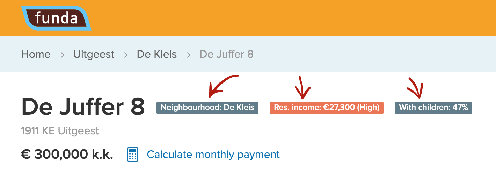
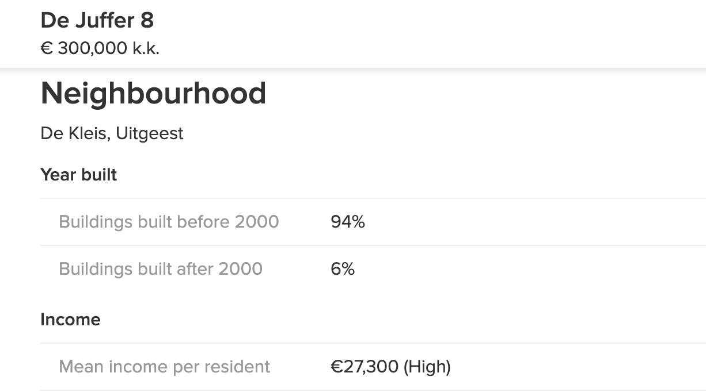

One nice thing about the Netherlands is that the government is okay with making statistical data available to everyone. You can go to [data.overheid.nl](https://data.overheid.nl/) and download a spreadsheet full of data for a topic you are interested in: be it agriculture, crimes or something else. They even maintain APIs that people use to build apps like this [map of income](https://cbsinuwbuurt.nl/#sub-buurten2015_gemiddeld_inkomen_inwoner).

Since I am currently searching for a house to buy, I visit real estate websites on a daily basis. The most popular housing website in the Netherlands is [Funda](https://www.funda.nl/).

Funda is great at providing info about the house, but it would be really helpful if it could also tell you about the neighbourhood. So I've built this simple extension that pulls data from Dutch Bureau of Statistics (CBS) and adds it to Funda, nicely formatted.

You can see badges with at-a-glance info on each property page. Go to extension "options" or click on a badge to customize what badges are shown.

If want more details, just scroll down to see a list of statistical facts about the hood. This table contains 30 datapoints divided into categories. You can learn about:

- Age of houses in the area
- Household types (singe-person, with / without children)
- Income of residents
- Age of residents
- Marital status of residents
- Immigraion background of residents

Hopefully this info helps you find a neighbourhood that you enjoy.

### Tech details

"Funda Neighbourhood" is written in plain vanilla JS and is built using Webpack. I am not using Babel since it's a Chrome / Edge extension and these two browsers are evergreen, so now transpilation needed.

This extension grabs a zipcode from the house page, then sends it to an API that returns latitude and longitude of this zipcode. Once we have the location we use it to fetch data from the Dutch Census Bureau API.

I've built the "get location by zipcode" API using AWS Lambda + DynamoDB. I've googled the dataset CSV and wrote a script that uploaded it to DynamoDB, 25 rows at a time (max batch-upload limit for DynamoDB). Uploading of 460000 rows took about 3 hours. I've also tried setting up an AWS Data Pipeline, but it proved to be much slower and also surprisingly costly (when I've discovered that I paid about \$2 to upload just 2000 rows, I canceled the pipeline). The script method is absolutely free. I will write about it in a separate post.

The tests are ran using Puppeteer and Jest. Normally I would pick Cypress for E2E tests, but Cypress doesn't support testing Chrome extensions, so I had to pick a more low-level tool.

### Future plans

- Translate it to Dutch using Chrome i18n API
- Add badges to map view
- Find / build a more up-to-date API for neighbourhood info

### Install extension

**Chrome**: https://chrome.google.com/webstore/detail/funda-neighbourhoods/jibdjhaojkpiagiccmolddmlhllancgj  
**Edge**: https://microsoftedge.microsoft.com/addons/detail/ndloapdppofpipoclcpehfijapbfbpip

### Source code

https://github.com/nikitaindik/funda-neighbourhoods
